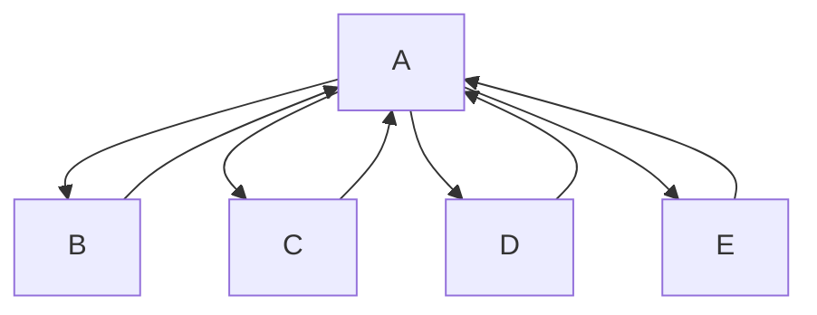

# Theater Seating
Julian, Mason, Seb, Abby

## Theater Seating Description
program that can be used by a theater to sell tickets for performances.  The theater’s auditorium has 15 rows of seats, with 30 seats in each row.  The program should display a screen that shows which seats are available and which are taken.  For example, the following graphic shows a chart depicting each seat in the theater.  Seats that are taken are represented by * symbol, and seats that are available are represented by a # symbol.

### Theater Seating Flowchart

#### Function Diagrams

| `main`    |               |  Abby     |
| ------------------ | ------------- | ------------ |
| `argument:type`    | takes input from the user for ____  |              |
| `time:integer`     | calculates ______  | outputs ____             |
| `name:string`      | takes input for name ___ | returns total |
***
| `function name1`    |               |     Mason   |
| ------------------ | ------------- | ------------ |
| `argument:type`    | takes input from the user for seat prices for each row  |              |
| `time:integer`     | calculates N/A  | outputs prices              |
| `name:string`      | takes input for price | returns price |
***
| `function name2`    |               |     Abby   |
| ------------------ | ------------- | ------------ |
| `argument:type`    | takes input from the user for tickets being sold  |              |
| `time:integer`     | calculates N/A  | outputs new seating chart             |
| `name:string`      | takes input for name ___ | returns total |
***
| `function name3`    |               |     Jullian   |
| ------------------ | ------------- | ------------ |
| `argument:type`    | takes input from the user for the total of all  |              |
| `time:integer`     | calculates the running total for all ticket sales  | outputs a total of the amount, and gives option to view it             |
| `name:string`      | takes input for name ___ | returns total |
***
| `listofsoldseats`    |               |     Seb   |
| ------------------ | ------------- | ------------ |
| `argument:type`    | takes input from the user for if they want to see sold seats  |              |
| `time:integer`     | calculates total seats sold  | outputs amount of open seats            |
| `name:string`      | takes input for name ___ | returns total |
***

